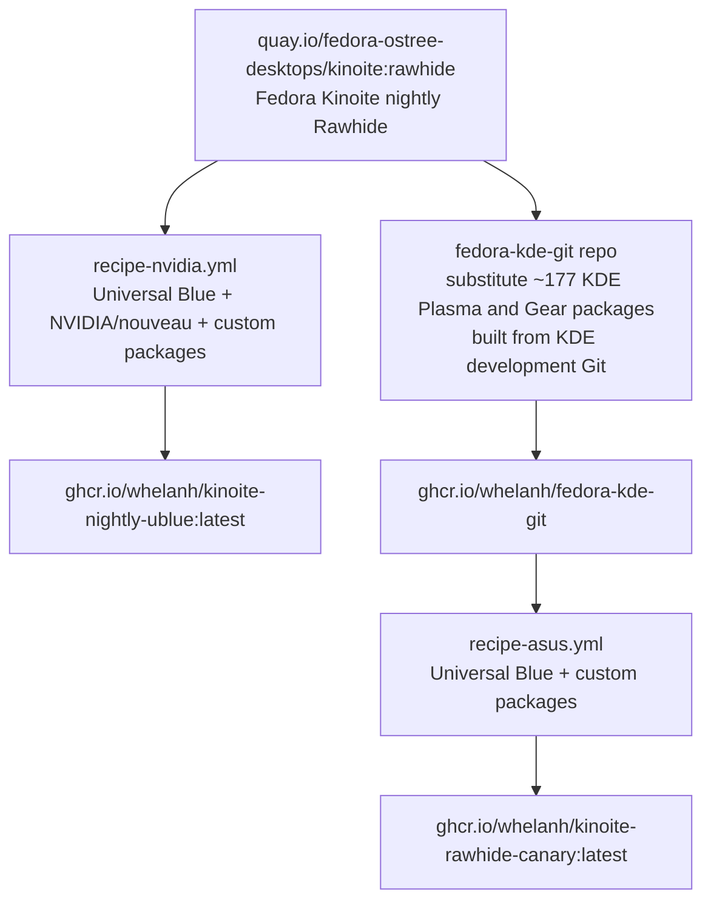

# myKinoiteNightly &nbsp; [](https://github.com/whelanh/myKinoiteNightly/actions/workflows/build.yml)
## *The leading edge of Fedora and KDE...with the safe rollback option built into Kinoite.*

<sub>See the [BlueBuild docs](https://blue-build.org/how-to/setup/) for quick setup instructions for setting up your own repository based on this template.</sub>

## 💽 My Custom Image


This repository produces **two** custom Fedora Kinoite images, both built on top of the Fedora Kinoite nightly Rawhide image (`quay.io/fedora-ostree-desktops/kinoite:rawhide`):

1. **`ghcr.io/whelanh/kinoite-nightly-ublue`** — the Kinoite nightly Rawhide image with the Universal Blue features, NVIDIA/nouveau drivers, and custom packages specified in [`recipes/recipe-nvidia.yml`](https://github.com/whelanh/myKinoiteNightly/blob/main/recipes/recipe-nvidia.yml).

2. **`ghcr.io/whelanh/kinoite-rawhide-canary`** — starts from the *same* Kinoite nightly Rawhide image, but substitutes approximately **177 KDE Plasma and Gear packages built from the KDE development Git**. That KDE-git base is produced by my separate [fedora-kde-git](https://github.com/whelanh/fedora-kde-git) repository and published as `ghcr.io/whelanh/fedora-kde-git`; the customizations in [`recipes/recipe-asus.yml`](https://github.com/whelanh/myKinoiteNightly/blob/main/recipes/recipe-asus.yml) are then applied on top of it.

> [!NOTE]
> These are the **only two images** currently produced by this repository. Other variants exist in the [`recipes/`](https://github.com/whelanh/myKinoiteNightly/tree/main/recipes) directory, but they are not actively built. The Cosmic Desktop recipe is currently commented out, though it could be re-added if you wish to create your own fork.

### 🔀 Build flow




## ⏭️ Changes

Both images layer a number of Universal Blue packages on top of the Kinoite Rawhide base in order to provide some of the features of a UBlue "dx" experience. The `kinoite-rawhide-canary` image additionally swaps in the latest in-development KDE Plasma and Gear packages built from the KDE development Git (via the [fedora-kde-git](https://github.com/whelanh/fedora-kde-git) repository). See [/recipes/recipe-nvidia.yml](https://github.com/whelanh/myKinoiteNightly/blob/main/recipes/recipe-nvidia.yml) and [/recipes/recipe-asus.yml](https://github.com/whelanh/myKinoiteNightly/blob/main/recipes/recipe-asus.yml) for details on what I've added.

Some custom ujust 'recipes' are provided to install homebrew, Universal Blue's Aurora brew bundle, and a curated list of flatpaks if desired.  See [/files/system/usr/share/ublue-os/just/60-custom.just](https://github.com/whelanh/myKinoiteNightly/blob/main/files/system/usr/share/ublue-os/just/60-custom.just) for the list of flatpaks. Also, if interested in Nix, automated ujust commands are available to simplify the installation process (see below for more details).

### Additional available ujust commands

- `ujust auto-setup-flatpaks` - Automatically install all development Flatpaks on first log in (*This is disabled currently*)
- `ujust install-dev-flatpaks` - Manually install all development Flatpaks
- `ujust remove-dev-flatpaks` - Remove all development Flatpaks (keeps user data)
- `ujust list-dev-flatpaks` - Show installation status of all development Flatpaks
- `ujust install-homebrew` - Install Homebrew (brew)
- `ujust install-aurora-brew-bundle` - Install Universal Blue's Aurora brew bundle
- `ujust install-fonts` - Install additional fonts (from Aurora)
- `ujust add-user-to-dx-group` - Add user to additional dev groups (from Aurora)
- `ujust nix-prep` - Prepare system for Nix installation (requires reboot)
- `ujust install-nix` - Install Nix with ostree support, nixpkgs unstable channel, and Home-Manager (run after `nix-prep` reboot)
- `ujust uninstall-nix` - Remove all Nix packages and uninstall Nix completely
- `ujust undo-nix-prep` - Undo nix-prep configuration and restore system to pre-Nix state (requires reboot)

### NVIDIA
This image includes a set of packages that should detect your NVIDIA GPU and use the appropriate driver (newer NVIDIA GPUs that can use the nouveau driver).

- `kernel-modules`
- `kernel-modules-extra`
- `linux-firmware`
- `mesa-dri-drivers`
- `xorg-x11-drv-nouveau`
- `libdrm` 

### Cosmic DE
The Cosmic desktop packages (the `ryanabx/cosmic-epoch` COPR repo and `cosmic-desktop`) are **currently commented out** in both recipes, so Cosmic is not installed in the images produced today. If you would like a Cosmic login option, you can uncomment those lines in your own fork. This project also includes a [/recipes/recipe-cosmic.yml](https://github.com/whelanh/myKinoiteNightly/blob/main/recipes/recipe-cosmic.yml) that (when built) produces a `ghcr.io/whelanh/cosmic-latest-ublue:latest` image with all of the custom ujust recipes and added packages of the kinoite-nightly image.

## 🛠️ Installation

> [!WARNING]  
> [This is an experimental feature](https://www.fedoraproject.org/wiki/Changes/OstreeNativeContainerStable), try at your own discretion.

To rebase an existing atomic Fedora installation to the latest build, first pick which of the two images you want:

- **`ghcr.io/whelanh/kinoite-nightly-ublue`** — Kinoite nightly Rawhide + Universal Blue + NVIDIA/nouveau (from `recipe-nvidia.yml`)
- **`ghcr.io/whelanh/kinoite-rawhide-canary`** — the KDE-git build (Plasma & Gear from Git) + Universal Blue (from `recipe-asus.yml`)

The commands below use `kinoite-nightly-ublue`; **substitute `kinoite-rawhide-canary`** in every command if you want the KDE-git image instead.

- First rebase to the unsigned image, to get the proper signing keys and policies installed:
  ```
  rpm-ostree rebase ostree-unverified-registry:ghcr.io/whelanh/kinoite-nightly-ublue:latest
  ```

- Reboot to complete the rebase:
  ```
  systemctl reboot
  ```
- Then rebase to the signed image, like so:
  ```
  rpm-ostree rebase ostree-image-signed:docker://ghcr.io/whelanh/kinoite-nightly-ublue:latest
  ```

- Reboot again to complete the installation
  ```
  systemctl reboot
  ```

The `latest` tag will automatically point to the latest build. Both images are built on the nightly `kinoite:rawhide` base image.

## Nix Install

To install Nix with ostree support, nixpkgs unstable channel, and Home-Manager, use the provided ujust commands:

```bash
ujust nix-prep
# System will reboot automatically
ujust install-nix
```

The `nix-prep` command prepares your system by configuring composefs and transient root, then automatically reboots. After the reboot, `install-nix` installs Nix with ostree support and sets up Home-Manager.

### Uninstalling Nix

To completely remove Nix and restore your system to its pre-Nix state:

```bash
ujust uninstall-nix
# After Nix is uninstalled, undo the system preparation:
ujust undo-nix-prep
# System will reboot automatically
```

The `uninstall-nix` command removes all installed Nix packages (installed via `nix profile install`) and uninstalls Nix completely. The `undo-nix-prep` command removes the composefs and transient root configuration, restoring your system to its original state, then automatically reboots.

<details>
<summary>Manual Installation Instructions (if preferred)</summary>

These steps are automated by the ujust commands above, but can be run manually if needed (following instructions from https://github.com/DXC-0/Nix-Dotfiles):

**Preparation**
```bash
sudo tee /etc/ostree/prepare-root.conf <<'EOL'
[composefs]
enabled = yes
[root]
transient = true
EOL

rpm-ostree initramfs-etc --reboot --track=/etc/ostree/prepare-root.conf
```
**Install Nix**
```bash
curl --proto '=https' --tlsv1.2 -sSf -L https://install.determinate.systems/nix | \
    sh -s -- install ostree --no-confirm --persistence=/var/lib/nix
```
**Add Nix Unstable**
```bash
nix-channel --add https://nixos.org/channels/nixpkgs-unstable nixpkgs
nix-channel --update
```
**Install Home-Manager**
```bash
nix-channel --update
nix-shell '<home-manager>' -A install
```
</details>

**Configure Home-Manager** (optional)

```bash
git clone https://github.com/DXC-0/Nix-Dotfiles.git [MORE LOGICALLY, YOUR OWN FORK OF THIS REPO]
cd Nix-Dotfiles
mkdir -p $HOME/.config/home-manager
mv * $HOME/.config/home-manager

home-manager switch
```

## ISO

If build on Fedora Atomic, you can generate an offline ISO with the instructions available [here](https://blue-build.org/how-to/generate-iso/#_top). These ISOs cannot unfortunately be distributed on GitHub for free due to large sizes, so for public projects something else has to be used for hosting.

## Verification

These images are signed with [Sigstore](https://www.sigstore.dev/)'s [cosign](https://github.com/sigstore/cosign). You can verify the signature by downloading the `cosign.pub` file from this repo and running the following command (substitute `kinoite-rawhide-canary` for the KDE-git image):

```bash
cosign verify --key cosign.pub ghcr.io/whelanh/kinoite-nightly-ublue:latest
```

## 🙏 Gratitude

I sincerely appreciate all of the hard work by **BlueBuild**, **Fedora**, **Universal Blue** and @silverhadch for providing the method to build the KDE Git packages. In particular, I thank **Universal Blue** for their packages available on the COPR repository.
